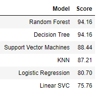

# Kaggle Titanic

## 题目介绍

- [题目介绍](https://www.kaggle.com/c/titanic)
- [Kaggle泰坦尼克-Python（建模完整流程，小白学习用）](http://www.cnblogs.com/rango-lhl/p/9686195.html)

## 项目简介

这是 Kaggle 上的一道机器学习入门题，里面包含了一些数据处理的基本方法和机器学习算法的简单应用。

## 结果

## 文件说明

- train.csv：训练数据
- test.csv：测试数据
- submission.csv：预测结果
- titanic_solution.ipynb：jupyter notebook 文件

